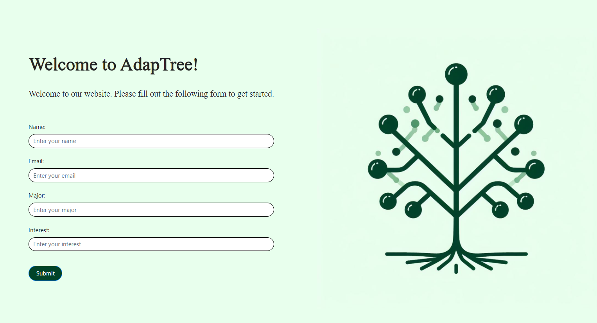

<!-- PROJECT LOGO -->
<br />
<p align="center">
  <a href="https://github.com/emilyjiji/gatoraidays">
    
  </a>
  <h3 align="center">AdapTree</h3>

  <p align="center">
    Cultivating Personalized Learning Through Engaging Dialogues
  </p>
</p>

## Table of Contents
- [About The Project](#about-the-project)
- [Built With](#built-with)
- [Getting Started](#getting-started)
  * [Dependencies](#dependencies)
  * [Installation](#installation)
- [Usage](#usage)
- [Roadmap](#roadmap)
- [License](#license)
- [Authors](#authors)
- [Acknowledgements](#acknowledgements)

## About The Project
AdapTree seeks to provide users with tailored educational content. Upon inputting their name, major, and field of interest, a knowledge tree is generated, which they can traverse, branch out, and delve deeper into topics of their choice. Every node is designed to offer both descriptions and the ability to spawn new learning paths. The tool is underpinned by a smart analogy-driven engine that contextualizes information based on the learner's background.



## Built With
- PostgreSQL
- React
- Django

## Getting Started
Follow the instructions to get AdapTree up and running on your local machine.

### Dependencies
- PostgreSQL
- React
- Django

### Installation
1. Clone the AdapTree repository:
   ```
   git clone https://github.com/emilyjiji/gatoraidays.git
   ```
2. Navigate to the project directory and install the required packages:
   ```bash
   cd AdapTree
   pip install -r requirements.txt
   ```
3. Make migrations and run the server:
   ```bash
   python manage.py makemigrations
   python manage.py migrate
   python manage.py runserver
   ```

## Usage
Detailed instructions on how to use AdapTree can be found [here](URL_TO_YOUR_INSTRUCTIONS).

## Roadmap
- Integrate multimedia content to enhance the learning experience.
- Develop an AI-driven quiz section to reinforce learned concepts.
- Gamify the learning experience, introducing rewards and milestones to motivate users.
- Implement a profile system, allowing users to track their progress and review recently covered topics.

## License
Distributed under the MIT License. See `LICENSE` for more information.

## Authors
- [Anirudh Tammisetti](https://github.com/anirudh343)
- [Emily Jiji](https://github.com/emilyjiji)
- [Matheus Kunzler Maldaner](https://github.com/matheusmaldaner)
- [Rahul Chari](https://github.com/rah-1)

## Acknowledgements
- The Verizon Hackathon Team for the opportunity.
- Marston Library for providing a working space.
